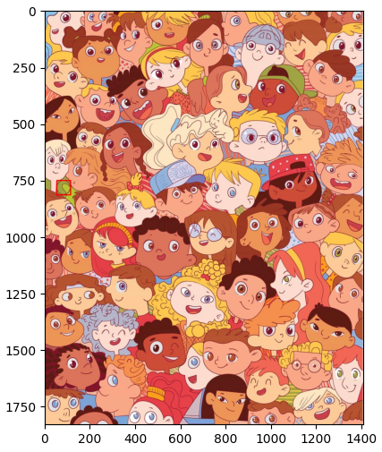
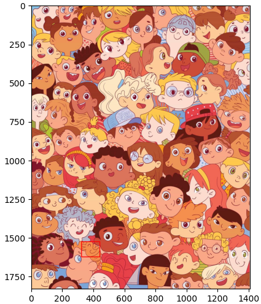

# Object Detection in Images (Shape-based Approach)

## 📌 Project Overview
This project implements an object detection system using image processing techniques, without relying on built-in functions, pre-trained models, or deep learning. The goal is to locate objects within an image based solely on their shape characteristics.

## 🎯 Features
- Custom Morphological Operations: Implemented dilation and erosion from scratch.

- Edge Detection: Used the Sobel operator to detect edges.

- Template Matching: Developed a correlation-based template matching algorithm.

- No Pre-built Functions: Avoided OpenCV's high-level functions such as cv2.Canny, cv2.matchTemplate, and cv2.morphologyEx.

## 🏗️ Implementation
### 1. Preprocessing
- Convert the input image to grayscale.

- Apply binary thresholding to segment objects.

### 2. Morphological Processing
- Dilation: Expands object boundaries to close small gaps.

- Erosion: Removes noise and refines object shapes.

### 3. Edge Detection
- Implemented Sobel filters to detect object edges manually.

### 4. Template Matching
- The sliding window technique scans the image.

- Computes correlation scores to detect object locations.

## 🚀 How to Run
### Prerequisites
Ensure you have Python and OpenCV installed:
```bash
pip install numpy opencv-python
```

### Run the Code in main.ipynb
Make sure to replace finding.jpg and 1.jpg with your own images.

## 🖼️ Sample Result

<table>
  <tr>
    <th>Result_1</th>
    <th>Result_2</th>
  </tr>
  <tr>
    <td></td>
    <td></td>
  </tr>
</table>

## 🔥 Why This Project Stands Out

- ✅ Manual implementation of image processing techniques 📸
- ✅ No deep learning, just pure computer vision logic 🧠
- ✅ Optimized and well-structured code ⚡
- ✅ Industry-relevant, demonstrating problem-solving skills 💼

## 🛠️ Technologies Used
- Python

- OpenCV (for basic I/O operations) 

- NumPy     

## 📌 Future Improvements

- Enhance rotation & scale invariance for template matching.

- Implement more robust noise removal techniques.

- Expand to multi-object detection with multiple templates.

## 🤝 Contact

- **Email:** [hungvv109@gmail.com](mailto:hungvv109@gmail.com)
- **LinkedIn:** [Hung Vu](https://www.linkedin.com/in/hung-vu-70b472282/?originalSubdomain=vn)

